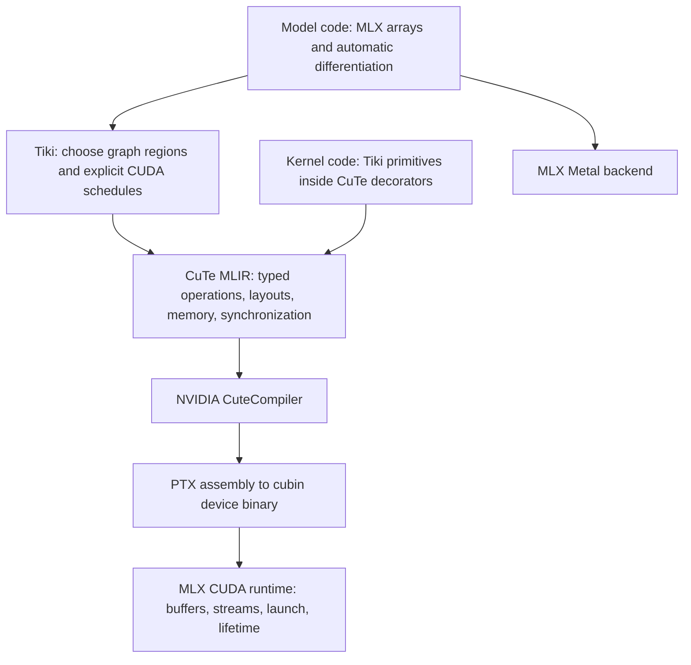

# Tiki

**Model code that reads like the math. Kernel code that says where every byte
goes. A compiler we can understand and steer.**

Tiki is Dedalus's experimental machine learning framework, built from MLX.
The ambition is to train and serve our models on NVIDIA GPUs with the precision
of hand-written CuTe kernels, while keeping MLX's native Apple silicon workflow
for local research. We want to own the path from an idea to the instructions
that execute it.

Write ordinary array code when the computation is ordinary. When performance
depends on a particular tile, memory layout, or instruction, express that
decision directly in Python. Keep the same arrays, automatic differentiation,
and runtime around both. Moving from a model to its critical kernel should feel
like opening the next level of detail.

This repository is an internal laboratory. We will bring the smallest proven
pieces into the Dedalus monorepo as they earn their place. MLX's source and
history remain the foundation; see [UPSTREAM.md](UPSTREAM.md).

## What works today

The repository contains an MLX checkout plus an isolated compiler experiment.
MLX still imports as `mlx`. An experimental `tiki.py` module now provides
`tk.compile` for float32 elementwise graphs; it is not an installed framework
package. **The examples under “The API we are working toward” remain design
targets beyond this subset.**

On a GH200, with CuTe DSL 4.7.1 and its Multi-Level Intermediate Representation
(MLIR), we have:

- Compiled serialized and textual CuTe MLIR in separate processes, without
  importing the reference kernel source in those compiler processes.
- Obtained byte-identical 4,416-byte CUDA device binaries from both inputs.
- Launched the binary compiled from serialized MLIR through MLX-owned buffers
  and its CUDA stream, with exactly correct results for 4,096 float32 additions.

The [experiment](experiments/cute_backend/README.md) and
[GH200 evidence](experiments/cute_backend/GH200_PROOF.md) are reproducible.
That original proof used a reference CuTe-decorated function. The
[native graph experiment](experiments/cute_backend/README.md#native-mlx-graph-compilation)
now captures actual MLX primitives through its export callback, emits CuTe MLIR
directly, and executes it on the GH200. Its graph and schedule can also be
inspected on a Mac. No kernel performance or compilation latency advantage has
been measured yet.

## The architecture we want

MLX supplies arrays, lazy evaluation, automatic differentiation, and device
execution. Tiki supplies the CUDA scheduling and kernel authoring layer.
CuTe supplies the layout algebra and NVIDIA compiler machinery.

A **schedule** specifies how work is tiled, assigned to threads, and overlapped
with memory transfers. A **layout** maps logical tensor coordinates to memory
addresses or thread-owned values. These decisions must survive compilation as
explicit, inspectable objects.

CUDA schedules should expose copy widths, shared-memory swizzles, matrix
instructions, pipeline stages, barrier ownership, and the division of work
between producer and consumer warps. Register and shared-memory budgets should
be visible before launch. Choosing a convenient default should never remove
the ability to specify a legal hardware decision explicitly.



MLIR is a compiler representation with typed operations and extensible
instruction vocabularies, called dialects. Tiki must emit the CuTe dialects and
contracts that NVIDIA's compiler accepts. Arbitrary MLIR does not acquire a
good GPU schedule by passing through CuTe. PTX is NVIDIA's virtual instruction
set; the assembler still determines the final machine instructions.

The kernel frontend should keep CuTe's staged Python model: ordinary Python
builds and specializes the kernel at compile time; `@cute.jit` and
`@cute.kernel` capture the device program. We can use that frontend for authored
kernels and emit CuTe MLIR directly for graph regions. Both paths should meet at
the same compiler artifact and launch contract. Generated Python files are not
part of that contract.

On Apple silicon, we retain MLX's Metal implementation. Model operations can
have implementations for both devices. A Hopper-specific kernel still requires
NVIDIA hardware; portability of the model does not imply identical kernel code
or schedules across Metal and CUDA.

## The API we are working toward

These examples describe behavior to implement and test. Their spelling can
change as we learn. The existing monorepo package `tiki` is a PyTorch training
toolkit with a CuTe library; installing it does not provide this proposed MLX
integration.

### Compile model code

The proposed `tk.compile` traces MLX array operations, selects supported graph
regions, and specializes them for the requested backend. This example asks for
a CuTe implementation of root mean square normalization with float32 reduction
and a float16 result:

```python
# Target API; not implemented in this repository.
import mlx.core as mx
import tiki as tk


@tk.compile(backend="cute")
def rms_norm(x: mx.array, weight: mx.array) -> mx.array:
    xf = x.astype(mx.float32)
    inv_rms = mx.rsqrt(mx.mean(xf * xf, axis=-1, keepdims=True) + 1e-6)
    return (xf * inv_rms * weight.astype(mx.float32)).astype(x.dtype)


mx.set_default_device(mx.gpu)
x = mx.random.normal((32, 4096)).astype(mx.float16)
weight = mx.ones((4096,), dtype=mx.float16)
mx.eval(rms_norm(x, weight))
```

Acceptance means a CuTe-produced kernel executes through MLX, preserves these
numerics, and composes with `mx.grad`. Unsupported operations, layouts, or
devices raise a typed error identifying the unsupported contract. Explicit
backend selection must never quietly run a different implementation.

### Write the attention kernel at the algorithm level

The monorepo already has the vocabulary we want: `Tensor`, `Gemm`, `Load`, and
`Warp`. A tensor records whether its values live in device memory, shared memory
within a thread block, or registers. Loads, stores, and synchronization remain
visible. `Gemm` expresses matrix multiply-accumulate operations; `Warp` controls
how groups of 32 CUDA threads divide the output tile.

This target fragment is adapted from the monorepo's
[compact FlashAttention backward kernel](https://github.com/dedalus-labs/dedalus/blob/7858ecd1aea016156a5df3eef36d40fbe5791892/packages/python/tiki/src/tiki/kernels/cute/flash_bwd_sm80_target.py).
It computes one non-causal query/key tile contribution to the gradients. The
caller loads the query (Q), key (K), value (V), and output gradient (dO) into
shared memory using `Load`, then calls this fragment inside a `@cute.kernel`
loop. The corresponding input gradients are dQ, dK, and dV.

```python
# Target kernel fragment; the monorepo library is not ported into this repo yet.
from cutlass import Int32
from tiki.kernels.cute.lib import Gemm, Tensor, Warp
from tiki.kernels.cute.lib.math import Float32, cute, exp2, thread_idx


@cute.jit
def attention_backward_tile(
    query: Tensor, key: Tensor, value: Tensor, grad_out: Tensor,
    lse_log2: Tensor, delta: Tensor, query_block: Int32,
    scale: Float32, grad_key, grad_value,
):
    # Q, K, V, dO: shared [64, 64], fp16. LSE and delta: global row vectors.
    # dK, dV: register [64, 64], fp32 accumulators owned by the caller.
    tidx, _, _ = thread_idx()
    qk = Gemm(query.raw.element_type, tidx, num_threads=128, warp=Warp(1, 4))
    kv = Gemm(query.raw.element_type, tidx, num_threads=128, warp=Warp(4, 1))
    probs_smem = Tensor(dtype=query.raw.element_type, rows=64, cols=64)  # shared, fp16
    ds_smem = Tensor(dtype=query.raw.element_type, rows=64, cols=64)     # shared, fp16

    # Gemm(a, b) computes a @ b.T; scores live in fp32 registers.
    probs = qk(a=query, b=key)
    probs.apply(
        vector=lse_log2, block_idx=query_block,
        fn=lambda score, lse: exp2(score * scale * 1.4426950408889634 - lse),
    )
    probs_smem.write(probs)  # register -> shared [64, 64], fp16, with barrier

    # dS = P * (dO @ V.T - delta), in fp32 registers.
    ds = qk(a=grad_out, b=value)
    ds.apply(vector=delta, block_idx=query_block, fn=lambda dp, d: dp - d)
    ds.mul(probs_smem)
    ds_smem.write(ds)  # register -> shared [64, 64], fp16, with barrier

    kv(a=probs_smem.T, b=grad_out.T, acc=grad_value)  # dV += P.T @ dO
    kv(a=ds_smem.T, b=query.T, acc=grad_key)          # dK += dS.T @ Q
    grad_query = qk(a=ds_smem, b=key.T)              # dQ = dS @ K
    grad_query.scale(scale)
    return grad_query
```

Here `lse_log2` is the forward log-sum-exp converted to base two, and
`delta = sum(grad_out * out, axis=-1)`. The caller zeroes dK/dV before visiting
query blocks and scales dK by `scale` after accumulation. Contributions to dQ
must be combined across key blocks. Register values carry their thread layouts;
passing accumulators between fragments must preserve those layouts.

This is a kernel fragment, not a full attention operator. The milestone includes
the outer loops, buffer lifetime and reuse barriers, output stores, forward
online softmax, bounds and causal masks, and an explicit backward registration
with MLX. A fast forward kernel alone does not make a trainable operator.

The forward pass should expose the stable online-softmax recurrence rather than
materialize the full sequence-by-sequence score matrix. For each query row and
new key tile, keep a running maximum `m`, denominator `l`, and output accumulator
`a` in float32:

```text
s     = scale * Q_tile @ K_tile.T
m_new = max(m, row_max(s))
alpha = exp(m - m_new)
p     = exp(s - m_new)
l     = alpha * l + row_sum(p)
a     = alpha * a + p @ V_tile
m     = m_new

out   = a / l
```

Initialize `m = -inf`, `l = 0`, and `a = 0`. Masks apply before the maximum.
Fully masked rows require defined output and gradient semantics so subtracting
two negative infinities cannot silently create NaNs. Tile shapes, row
reductions, precision conversions, and the pipeline remain part of the
implementation contract.

### Control the layout without generating source templates

A swizzle permutes address bits to change which shared-memory banks simultaneous
accesses hit. It is a layout value we construct and compose, not a string to
substitute into a kernel. The existing CuTe library already uses this pattern:

```python
# CuTe layout construction, used during staging; not a complete kernel.
from cutlass import cute

atom = cute.make_composed_layout(
    cute.make_swizzle(3, 3, 3),
    0,
    cute.make_ordered_layout((8, 64), order=(1, 0)),
)
layout = cute.tile_to_shape(atom, (64, 64), (0, 1))
```

This is one float16 layout candidate from the monorepo's
[layout builder](https://github.com/dedalus-labs/dedalus/blob/7858ecd1aea016156a5df3eef36d40fbe5791892/packages/python/tiki/src/tiki/kernels/cute/lib/tile.py).
Its suitability depends on the copy and matrix instructions consuming it.
The target library lets an author supply this layout directly, inspect its
address mapping, or choose among validated candidates with autotuning.
Autotuning means compiling and measuring several legal schedules.

Every wrapped kernel object should retain access to its underlying CuTe object
through `.raw`, as the monorepo library does today. An author can use a new
instruction before we add a convenience wrapper. Memory effects, synchronization,
and differentiation requirements still have to be declared and validated.

## Milestones

These are completion gates. Gates 0 and 1 have been demonstrated in this repo.

| Gate | Deliverable | Evidence required to mark it complete |
| --- | --- | --- |
| **0. Compiler connection — demonstrated** | CuTe MLIR to device binary to MLX CUDA launch. | Recorded GH200 compiler artifacts and exact vector-add results. This does not include an MLX graph emitter. |
| **1. First native graph region — demonstrated** | `tk.compile` captures an MLX elementwise graph and emits a chosen schedule as CuTe MLIR. | Ten GH200 tests cover arithmetic, scalar broadcasting, empty and partial tiles, input packing, specialization reuse, and unsupported cases. The compiler path consumes direct MLIR; see the native graph experiment. |
| **2. Kernel library on MLX** | Port the smallest `Tensor`/`Load`/`Gemm`/`Warp` subset; implement the normalization target and expose custom-op differentiation. | Numerical and gradient checks, explicit memory/stream ownership, safe shared-buffer reuse, concurrent compilation without shared mutable staging state, and no PyTorch runtime dependency. |
| **3. FlashAttention that trains** | Implement tiled online-softmax forward and the compact backward target. Start with one fixed non-causal specialization, then expand. | Output and dQ/dK/dV comparisons against independent references; finite-difference checks on small cases; float16/bfloat16, causal and partial tiles; peak-memory evidence that no full score matrix is stored. Validate Ampere mechanics on Ampere and Hopper schedules on Hopper. |
| **4. Fast compilation and inspectable tuning** | Cache compiled artifacts, expose every lowering stage, and tune legal schedule candidates. | Cold compile, persistent-cache hit, warm launch, and tuning costs measured separately; cache identity covers source/MLIR, compiler version/options, target, shapes/strides, dtype, constants, layout, schedule, and binary calling convention. Invalid candidates fail before benchmarking. |
| **5. Useful model workloads** | Cached language-model decoding, low-rank adaptation (LoRA) fine-tuning, and a complete single-GPU transformer training step. | Matched checkpoints, precision, sequence lengths, optimizer settings and numerical checks against MLX and PyTorch; latency, tokens/second, peak memory, and compilation costs saved with samples. Apple Metal correctness and performance remain release gates. |
| **6. A pretraining runtime** | Stream-aware collectives and independent communication groups; then data, tensor, pipeline, and fully sharded training. | Real multi-GPU overlap and correctness tests, shard/checkpoint round trips, restart and failure behavior, and scaling measurements before calling Tiki a pretraining framework. |
| **7. Internal adoption** | Move the proven compiler/runtime subset into the monorepo and train a model we care about. | Reproducible runs, maintainable upstream merges, measured iteration-time benefit, and an explicit ownership boundary between framework, kernels, and training code. |

Gate 4 can advance alongside kernel work. Gate 6 is a substantial runtime
project: access to NVIDIA's collective library does not by itself supply a
correct sharded-training implementation.

## What performance success means

The aspiration is CuTe DSL's kernel quality and just-in-time compilation
latency, with little added framework work. Reusing `CuteCompiler` gives us the
same backend; it does not guarantee the same compile time or device performance.
Graph processing, specialization, layout conversion, and tuning all cost time.

For the first fixed suite, our proposed budgets are at most **10% extra cold
compile time** and **5% extra warm launch time** relative to direct CuTe DSL with
the same schedule. Device latency should be within **5%** of that equivalent
kernel. Measure persistent-cache hits separately and require that they avoid
compiler invocation. These are initial engineering targets, not benchmark
results or universal guarantees.

Passing those budgets establishes that the framework preserves a good kernel.
Earning adoption also requires measuring against tuned alternatives for the
actual workload, including PyTorch attention and upstream MLX. We report
speed-of-light (SOL) efficiency only against a named compute or memory ceiling,
with the traffic accounting and precision stated. Pretty MLIR and PTX are useful
debugging artifacts; elapsed time, memory use, and correct training decide.

PyTorch already supports custom CUDA kernels and has
[CuTe integration in Inductor](https://github.com/pytorch/pytorch/blob/main/torch/_inductor/codegen/cutedsl/README.md).
Our opportunity is a smaller framework with direct, consistent access to the
kernel decisions that matter. A claim of greater fundamental CUDA expressivity
would be misleading. A substantially better kernel-development experience is
something we can build and measure.

## Start here

Read the [compiler experiment](experiments/cute_backend/README.md), then inspect
`mlx/backend/cuda/compiled.cpp` for the existing MLX graph compilation route and
`mlx/backend/cuda/custom_kernel.cpp` for precompiled kernel execution.
With this checkout built for CUDA and importable as `mlx`:

```sh
python -m pip install -r experiments/cute_backend/requirements.txt
python experiments/cute_backend/probe.py --arch sm_90 --output /tmp/tiki-cute-proof
python experiments/cute_backend/run_mlx.py --arch sm_90
```

Use a fresh output directory for the probe. Source build instructions are in
[the retained MLX installation guide](docs/src/install.rst).

The design references in the monorepo are pinned to commit
`7858ecd1aea016156a5df3eef36d40fbe5791892`:

- [Kernel library and its memory-level API](https://github.com/dedalus-labs/dedalus/blob/7858ecd1aea016156a5df3eef36d40fbe5791892/packages/python/tiki/src/tiki/kernels/cute/lib/README.md)
- [Full FlashAttention backward reference](https://github.com/dedalus-labs/dedalus/blob/7858ecd1aea016156a5df3eef36d40fbe5791892/packages/python/tiki/src/tiki/kernels/cute/flash_bwd_sm80.py)
- [Compact backward target](https://github.com/dedalus-labs/dedalus/blob/7858ecd1aea016156a5df3eef36d40fbe5791892/packages/python/tiki/src/tiki/kernels/cute/flash_bwd_sm80_target.py)
- [Associative scan, an independent kernel family](https://github.com/dedalus-labs/dedalus/blob/7858ecd1aea016156a5df3eef36d40fbe5791892/packages/python/tiki/src/tiki/kernels/cute/ASSOCIATIVE_SCAN.md)
- [Autotuner](https://github.com/dedalus-labs/dedalus/blob/7858ecd1aea016156a5df3eef36d40fbe5791892/packages/python/tiki/src/tiki/kernels/cute/lib/autotuner.py) and [profiler](https://github.com/dedalus-labs/dedalus/blob/7858ecd1aea016156a5df3eef36d40fbe5791892/packages/python/tiki/src/tiki/kernels/cute/lib/profiler.py)

These are design inputs, not a claim that all their planned behavior has been
validated. NVIDIA documents CuTe's staged Python and lowering model in its
[code generation guide](https://docs.nvidia.com/cutlass/latest/media/docs/pythonDSL/cute_dsl_general/dsl_code_generation.html).

MLX was developed by Apple machine learning research; its code remains under
the [MIT license](LICENSE). CuTe DSL has its own
[NVIDIA license terms](https://docs.nvidia.com/cutlass/latest/media/docs/pythonDSL/license.html).
See the [upstream README](https://github.com/ml-explore/mlx/blob/b6368984b8e02a3fb3ee7986846c0fb85e1fccf7/README.md)
for MLX's original introduction, acknowledgments, and citation.
