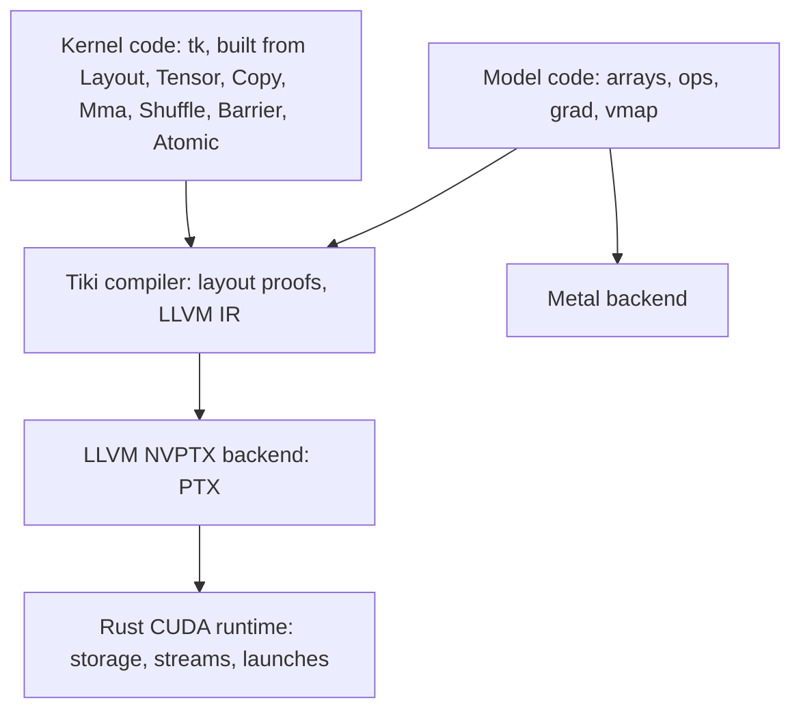

# Tiki

**Model code that reads like the math. Kernel code that says where every byte
goes. A compiler we can understand and steer.**

Tiki is Dedalus's experimental machine learning framework, built from upstream MLX.
The ambition is to train and serve our models on NVIDIA GPUs with the precision
of hand-written CuTe kernels, while keeping upstream MLX's native Apple silicon
workflow for local research. We want to own the path from an idea to the
instructions that execute it.

Write ordinary array code when the computation is ordinary. When performance
depends on a particular tile, memory layout, or instruction, express that
decision directly in Python. Keep the same arrays, automatic differentiation,
and runtime around both. Moving from a model to its critical kernel should feel
like opening the next level of detail.

This repository is an internal laboratory. We will bring the smallest proven
pieces into the Dedalus monorepo as they earn their place.

## Architecture

Tiki is memory safe from its Python API to the GPU. Rust owns every line of
host code: the graph, operators, differentiation, compilation, allocation,
streams and launches. The Python API stays the same.

GPU kernels are written in `tk`, Tiki's kernel language, which follows CuTe's
semantics: layouts as algebra, tensors, thread-value partitions, and copy and
matrix atoms. The compiler proves each kernel's memory accesses from its
layouts and lowers it through LLVM IR and LLVM's NVPTX backend to PTX.

```mermaid
flowchart TD
    model[Model code: arrays, ops, grad, vmap]
    kernels[Kernel code: tk, built from Layout, Tensor, Copy, Mma, Shuffle, Barrier, Atomic]
    compiler[Tiki compiler: layout proofs, LLVM IR]
    nvptx[LLVM NVPTX backend: PTX]
    runtime[Rust CUDA runtime: storage, streams, launches]
    metal[Metal backend]

    model --> compiler
    kernels --> compiler --> nvptx --> runtime
    model --> metal
```

On Apple silicon, Tiki keeps upstream MLX's Metal implementation. A Hopper-specific
kernel still requires NVIDIA hardware; portability of the model does not imply
identical kernel code or schedules across Metal and CUDA.

## What works today

- **Layout algebra.** The [`tiki-cute`](tiki/cute/README.md) crate implements
  the CuTe layout algebra in Rust, with static and dynamic extents, and replays
  every integer case PyCuTe's own test suite records.
- **Layouts on arrays.** `tiki.layout` gives every evaluated array a first-class
  layout and exposes its strides and offset.
- **Rust CUDA runtime.** The [runtime](docs/src/dev/runtime.rst) owns CUDA
  devices, streams, and device memory as Rust values, with cached allocation,
  memory limits, and batch completion.

The [framework design](docs/src/dev/design.rst) defines the nouns, and
[kernels](docs/src/dev/kernels.rst) writes each kernel family in `tk`. The
`tk` compiler that lowers them is the next milestone.

## Performance

NVIDIA's CuTe DSL is the correctness and performance oracle. A `tk` kernel is
done when its device latency is within 5% of the equivalent CuTe DSL kernel
with the same schedule, and a persistent-cache hit avoids compilation
entirely. Adoption also requires measuring against tuned alternatives for the
actual workload, including PyTorch attention and upstream MLX. We report
speed-of-light efficiency only against a named compute or memory ceiling, with
the traffic accounting and precision stated.

## Start here

- The [runtime](docs/src/dev/runtime.rst) covers compiling versus running,
  memory lifetime, stream order, and how the Rust stack replaces the C++
  backend.
- The [CuTe MLIR experiments](https://github.com/dedalus-labs/tiki/tree/5555d20225b0befb21d7c56782384a20a1027b42/experiments)
  are the reference design for the lowering, with their GH200 measurements.
- Source build instructions are in
  [the installation guide](docs/src/install.rst).

The kernel references in the monorepo are pinned to commit
`7858ecd1aea016156a5df3eef36d40fbe5791892`:

- [Kernel library and its memory-level API](https://github.com/dedalus-labs/dedalus/blob/7858ecd1aea016156a5df3eef36d40fbe5791892/packages/python/tiki/src/tiki/kernels/cute/lib/README.md)
- [Full FlashAttention backward reference](https://github.com/dedalus-labs/dedalus/blob/7858ecd1aea016156a5df3eef36d40fbe5791892/packages/python/tiki/src/tiki/kernels/cute/flash_bwd_sm80.py)
- [Associative scan](https://github.com/dedalus-labs/dedalus/blob/7858ecd1aea016156a5df3eef36d40fbe5791892/packages/python/tiki/src/tiki/kernels/cute/ASSOCIATIVE_SCAN.md)

MLX was developed by Apple machine learning research; its code remains under
the [MIT license](LICENSE). See the
[upstream README](https://github.com/ml-explore/mlx/blob/b6368984b8e02a3fb3ee7986846c0fb85e1fccf7/README.md)
for Tiki's original introduction, acknowledgments, and citation.
