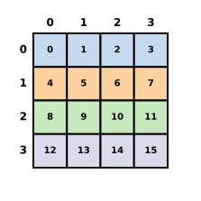
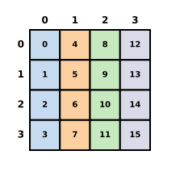
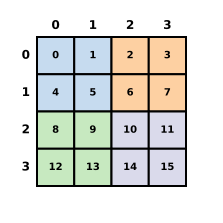
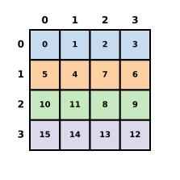

.. _tiki-layout-build:

Tiki layouts
==============

Every Tiki array carries a CuTe-inspired layout. A layout is a function from a
coordinate to an integer index. For an array, that index is an element offset
into its storage.

One layout object serves three consumers. Python indexes through it, the
compiler tiles through it, and the kernel computes addresses through it.

Our goal is to provide motivation for why we designed the Tiki array primitive
to natively support CuTe-like layouts.

Why layouts are native
----------------------

Let's start with a simple example: a 4 by 4 row-major matrix. Element
``(2, 3)`` is at index ``(4 * 2) + (1 * 3) = 11``. Drawing every index in
its cell shows the whole layout at once:

   ``Layout(shape=(4, 4), stride=(4, 1))``. Each cell shows its index. Color marks the storage row.

The index is the dot product of the coordinate with the strides ``(4, 1)``.
The same rule gives one integer for a coordinate of any rank:

.. list-table::
   :header-rows: 1

   * - Shape
     - Strides
     - Coordinate
     - Index
   * - ``(4, 4)``
     - ``(4, 1)``
     - ``(2, 3)``
     - ``(4 * 2) + (1 * 3) = 11``
   * - ``(2, 2, 2)``
     - ``(4, 2, 1)``
     - ``(1, 0, 1)``
     - ``(4 * 1) + (2 * 0) + (1 * 1) = 5``
   * - ``(2, 2, 2, 2)``
     - ``(8, 4, 2, 1)``
     - ``(1, 1, 0, 1)``
     - ``(8 * 1) + (4 * 1) + (2 * 0) + (1 * 1) = 13``

These strides are row-major: each stride is the product of the shape entries
after it. In the last two rows every extent is 2, so the index is the
coordinate read as a binary number. Column-major strides for ``(4, 4)`` are
``(1, 4)`` and send ``(2, 3)`` to ``(1 * 2) + (4 * 3) = 14``.

   ``Layout(shape=(4, 4), stride=(1, 4))``. The same sixteen indices, placed down the columns.

An integer is also a coordinate. Any integer below the size of a shape names
one coordinate of that shape, read with the first mode varying fastest, so
the 4 by 4 layout sends ``6`` and ``(2, 1)`` to the same index,
``(4 * 2) + (1 * 1) = 9``.

Every array framework stores strides, and they are enough for row-major and
column-major order, views, and broadcasting.

Tiling is the first thing strides alone cannot do. A kernel that loads 2 by 2
tiles addresses the matrix by a nested coordinate. Each axis splits into the
position within the tile and the tile index.

Nested strides can express the tiled map. Each axis now has two coordinates,
and each coordinate has its own extent and stride:

.. list-table::
   :header-rows: 1

   * - Coordinate
     - Meaning
     - Extent
     - Stride
   * - ``r``
     - row within the tile
     - 2
     - 4
   * - ``R``
     - tile row
     - 2
     - 8
   * - ``c``
     - column within the tile
     - 2
     - 1
   * - ``C``
     - tile column
     - 2
     - 2

The index is ``(4 * r) + (8 * R) + (1 * c) + (2 * C)``. Element ``(2, 3)`` is
row ``r = 0`` of tile row ``R = 1`` and column ``c = 1`` of tile column
``C = 1``, so its index is ``0 + 8 + 1 + 2 = 11``. The indices have not moved;
only the coordinates that name them have:

   ``logical_divide`` by ``(2, 2)``. Every index stays in place. Color marks the tile.

Deriving those strides by hand is the problem. A kernel author repeats the
derivation for every tile shape, and a mistake produces a wrong address rather
than an error.

The CuTe layout algebra derives them. ``logical_divide`` of the row-major
layout by the tile shape ``(2, 2)`` returns the layout above:

.. code-block:: console

   $ python
   >>> import mlx.tiki as tk
   >>> base = tk.Layout((4, 4), stride=(4, 1))
   >>> tiles = tk.logical_divide(base, (2, 2))
   >>> tiles
   Layout(shape=((2, 2), (2, 2)), stride=((4, 8), (1, 2)))
   >>> print(tiles.describe())
   coordinate  extent  stride
   c[0][0]     2       4
   c[0][1]     2       8
   c[1][0]     2       1
   c[1][1]     2       2
   index = 4 * c[0][0] + 8 * c[0][1] + 1 * c[1][0] + 2 * c[1][1]

``describe()`` prints the table from this page with one coordinate per row,
named by its position in the shape. ``format(tiles, "cute")`` gives the CuTe
string, ``((2, 2), (2, 2)):((4, 8), (1, 2))``, for comparison with the
CUTLASS documentation.

Swizzling is the second thing strides cannot do. A tile in shared memory avoids
bank conflicts by applying exclusive-or (XOR) to bits of the offset.

``Swizzle(bits=2, base=0, shift=2)`` XORs each two-bit field of the index
with the field two bits above it (:ref:`tiki-layouts` defines the three
parameters). Applied after the row-major map, it sends row 1 to indices
``[5, 4, 7, 6]``. The column increment changes from row to row, so no pair of
integer strides describes this map on the ``(4, 4)`` domain:

.. code-block:: console

   >>> swizzled = tk.compose(tk.Swizzle(bits=2, base=0, shift=2), base)
   >>> [swizzled(1, column) for column in range(4)]
   [5, 4, 7, 6]
   >>> swizzled.stride
   Traceback (most recent call last):
     ...
   mlx.tiki._layout.LayoutError: a composed layout has no stride. Require an affine layout

Every row permutes its four indices differently:

   ``Swizzle(bits=2, base=0, shift=2)`` after the row-major map. Color still marks the storage row, so each row's data stays in its row while the columns permute.

A stride tuple therefore cannot be the representation. A layout must be a
value that composes, and the swizzled tile is the composition
``swizzle(base(coordinate))``:

.. code-block:: console

   >>> swizzled
   ComposedLayout(
       inner=Layout(shape=(4, 4), stride=(4, 1)),
       offset=0,
       outer=Swizzle(bits=2, base=0, shift=2),
   )

The printed order is the evaluation order: ``index = outer(offset + inner(coordinate))``.

That one value is what the Python array holds. The compiler reads the same
value to tile, and the kernel reads it to address memory, so no stage derives
the map again.

PyTorch and JAX stop at strides. A PyTorch tensor exposes sizes and strides,
and view operations such as ``permute`` and ``as_strided`` [6]_ produce new
strides. Strides have no composition, division, or product, so a kernel
derives its tiling from the strides it receives.

JAX's ``jax.experimental.layout`` package [5]_ provides ``Layout`` and
``Format``. ``Layout.major_to_minor`` gives the dimension order in device
memory, and ``Format`` pairs a layout with a sharding for ``jit`` and
``device_put``. The package is experimental, and it describes memory order
rather than a map that a program can compose.

CUTLASS implements the algebra in C++ templates at kernel compile time [4]_.
The arrays that a Python program holds cannot reach it.

Tiki's separation of Engine and layout follows the design of
`Zop <https://github.com/zop-lang/zop>`_, an experimental systems language
whose tensors and views carry inspectable CuTe-native Engine and Layout
values.

The layout algebra
------------------

A CuTe layout is a shape and a stride with the same nesting. Together they
define the map from a coordinate to an integer index, and an array reads its
storage through that index::

   tensor[coordinate] = engine[layout(coordinate)]

The Engine owns or retains the storage. The layout is independent of it, which
is why one Engine can serve several layouts.

The algebra has three operations:

- Composition, ``compose(A, B)``, is function composition,
  ``A(B(coordinate))``. The integer that ``B`` produces is read as a
  coordinate of ``A``'s shape, so a chain of layouts maps coordinates to
  coordinates until the last one produces the index.
- Complement, ``complement``, describes the part of a codomain that a layout
  does not reach.
- Logical division and logical product, ``logical_divide`` and
  ``logical_product``, tile one layout by another. Both are defined from
  composition and complement.

Each operation is defined only under conditions on the shapes and strides.
Tiki checks the conditions when it builds a map, and an invalid map raises
:class:`mlx.tiki.LayoutError` instead of producing a wrong offset.

Shah [1]_ states sufficient conditions and closed formulas for complement,
composition, and logical division. Carlisle, Shah, Stern, and VanKoughnett
[2]_ define two categories, Tuple and Nest, whose morphisms are the tractable
layouts: row-major, column-major, compact, strided, and broadcast layouts,
among others.

In that framework, composition of layouts is composition of the underlying
maps, and each algebra operation corresponds to an operation on morphisms.
Cecka [3]_ gives NVIDIA's reference definition and ships PyCuTe, the Python
implementation that Tiki vendors for the affine algebra.

The Rust extension implements indexing and composed transforms.
:ref:`tiki-layouts` describes the indexing model, and
:ref:`tiki-layout-recipes` shows the operations in use.

Requirements
------------

The layout extension builds with the framework. The build requires:

- Python 3.10 or later.
- CMake 3.25 or later.
- A C++ compiler with C++20 support, such as Clang 15.0 or later. On macOS,
  Xcode 15.0 or later with the macOS 14.0 SDK or later. On Linux,
  ``libblas-dev``, ``liblapack-dev``, and ``liblapacke-dev``.
- Rust 1.92 or later with Cargo. The ``tiki-layout`` crate declares this
  minimum in its ``rust-version`` field, and Cargo rejects older toolchains.
- Doxygen and the packages in ``docs/requirements.txt``, for the
  documentation build.

See :doc:`../install` for the platform details of the framework build.

Build the framework
-------------------

1. Install the requirements.
2. From the repository root, run::

      python -m pip install .

   The build compiles the ``tiki-layout`` crate and links it into the
   ``tiki_layout_python`` extension through CXX.

Expected result: the extension is importable and computes offsets.

.. code-block:: sh

   python -c "import mlx.tiki as tk; print(tk.Layout((4, 4), stride=(4, 1))(2, 3))"

This command prints ``11``.

Build only the layout extension
-------------------------------

Use this procedure to change the extension without rebuilding ``mlx.core``.

1. With the framework installed, configure a build that disables every
   backend and writes the Python bindings into the checkout::

      cmake -S . -B build/indexing \
        -DMLX_BUILD_CPU=OFF -DMLX_BUILD_METAL=OFF -DMLX_BUILD_CUDA=OFF \
        -DMLX_BUILD_TESTS=OFF -DMLX_BUILD_EXAMPLES=OFF \
        -DMLX_BUILD_PYTHON_BINDINGS=ON -DMLX_BUILD_PYTHON_STUBS=OFF \
        -DPython_EXECUTABLE="$(command -v python)" \
        -DMLX_PYTHON_BINDINGS_OUTPUT_DIRECTORY="$PWD/python/mlx"

   On macOS, set ``CMAKE_OSX_DEPLOYMENT_TARGET`` to the minimum OS version of
   the installed core. CMake forwards the value to Cargo.

2. Build the extension target::

      cmake --build build/indexing --target tiki_layout_python

3. Put the checkout ahead of the installed package::

      export PYTHONPATH=python

Expected result: ``import mlx.tiki`` loads the extension from ``python/mlx``
and ``mlx.core`` from the installed package.

Run the checks
--------------

Run the Rust and Python checks from the repository root::

   cargo test --manifest-path mlx/layout/Cargo.toml --all-features
   cargo fmt --manifest-path mlx/layout/Cargo.toml --check
   cargo clippy --manifest-path mlx/layout/Cargo.toml --all-targets --all-features -- -D warnings
   PYTHONPATH=python:python/tests python -m unittest discover -s python/tests -p 'test_tiki_*.py'

``test_tiki_docs`` parses :doc:`../usage/layouts` and
:doc:`../examples/layouts` and runs every example in them as a doctest. The
published examples and the tests are one source.

Build and test the documentation
--------------------------------

1. Install Doxygen and the packages in ``docs/requirements.txt``.
2. With ``mlx.core`` and the extension importable, build the site and run the
   doctest directives::

      cd docs
      doxygen
      PYTHONPATH=../python make html O=-W
      PYTHONPATH=../python sphinx-build -b doctest -W \
        -D doctest_test_doctest_blocks= src build/doctest

Expected result: both commands exit with status 0 and no warnings, and the
site is in ``docs/build/html``.

References
----------

.. [1] Jay Shah. *A note on the algebra of CuTe layouts*. Colfax Research,
   December 2023, revised January 2024.
   https://research.colfax-intl.com/a-note-on-the-algebra-of-cute-layouts/
.. [2] Jack Carlisle, Jay Shah, Reuben Stern, and Paul VanKoughnett.
   *Categorical foundations for CuTe layouts*. arXiv:2601.05972, January 2026.
   https://arxiv.org/abs/2601.05972
.. [3] Cris Cecka. *CuTe layout representation and algebra*. arXiv:2603.02298,
   March 2026. https://arxiv.org/abs/2603.02298
.. [4] NVIDIA. *CuTe layout algebra*. CUTLASS documentation.
   https://docs.nvidia.com/cutlass/latest/media/docs/cpp/cute/02_layout_algebra.html
.. [5] JAX. *Device-local array layout control*.
   https://docs.jax.dev/en/latest/notebooks/layout.html
.. [6] PyTorch. *torch.Tensor.as_strided*.
   https://docs.pytorch.org/docs/stable/generated/torch.Tensor.as_strided.html
