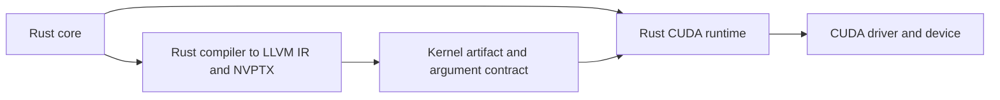

# Rust CUDA backend architecture

The Rust CUDA backend provides a resource-safe execution boundary for Tiki
graphs and compiled kernels. Its design separates tensor semantics, GPU
scheduling, and device execution so that improving one layer does not require
replacing the others. [ADR-0001](DECISION-2026-09-05.md) records the language and
interoperability choices; the [backend overview](README.md#implementation-status)
records implementation status.

The requirements in this document define the backend contract. They are
implementation obligations, not claims of completed verification.

## Responsibilities and boundaries

| Layer | Responsibility |
| --- | --- |
| Rust core | Tensor semantics, graphs, differentiation |
| Rust compiler | Kernel IR, proofs, LLVM IR |
| Rust CUDA runtime | Memory, ordering, launches, retirement |
| Rust device accessors | Addresses in inherited C++ kernels |
| Tiki kernels | CuTe-style layouts, atoms, pipelines |
| CUDA driver and device | Module loading, execution, completion |

During the migration, a CXX bridge lets remaining C++ host code call the Rust
runtime. The bridge is removed once the host is Rust.

The compiler turns kernels written in Tiki's kernel language, and kernels it
generates for fused graph regions, into a kernel IR with CuTe semantics. It
proves each kernel's accesses from its layouts, lowers it to LLVM IR, and
compiles that with LLVM's open NVPTX backend to PTX. Compilation produces a kernel artifact:
the GPU binary, its entry point, and the information required to bind
arguments and launch it. The CuTe MLIR compiler in `experiments/cute_backend` is
the reference design for this lowering.

## Rationale for Rust

Asynchronous GPU work can continue after the host function that submits it
returns. Allocations, loaded modules, workspaces, and transfer destinations must
therefore outlive device use, not merely the submitting function. CUDA stream
ordering is also distinct from host-language object lifetime.

Rust provides ownership, borrowing, and explicit unsafe boundaries that can
encode these requirements in the runtime API. Resource owners can control
destruction, views can retain their backing storage, and completion objects can
represent outstanding device use. This reduces reliance on separate raw-pointer
conventions at individual call sites.

C++ can implement the same lifetime rules at each call site. Rust enforces
them in the type system, so a call site that breaks one fails to compile. GPU
kernels keep their existing language until a Rust kernel matches their speed,
and ADR-0001 records where each kernel family runs.

## Rust implementation model

The backend uses ordinary Rust resource owners and explicit state transitions.
It does not expose CUDA pointers as general-purpose mutable host references.

- **Stable host toolchain.** Runtime and bridge code target stable Rust. GPU
  compiler internals and experimental Rust device-language extensions are not
  requirements of the host interface.
- **Concrete runtime types.** Allocation, kernel, submission, and executable
  graph objects each have a defined ownership responsibility. Driver and
  dependency types remain internal to the backend interface.
- **Ownership through completion.** Shared ownership represents resource
  liveness. Access descriptors and completion dependencies separately represent
  the permitted reads and writes.
- **Scoped borrowing.** A borrow used to prepare arguments cannot authorize
  device access beyond its lifetime unless submission establishes an independent
  resource owner and the required access ordering.
- **Explicit completion.** Submission and waiting are separate operations.
  Waiting can expose a synchronous or asynchronous host interface, but both
  enforce the same device-completion contract.
- **Typed errors.** Invalid arguments, unsupported capabilities, submission
  failures, and device failures remain distinguishable. An error does not release
  resources while previously submitted work can still access them.
- **A restricted unsafe layer.** CUDA calls, foreign handles, and binary argument
  construction are confined to reviewed adapters. Safe callers operate on
  validated runtime objects.

Thread-sharing guarantees must account for CUDA context affinity and resource
access ordering. Implementing `Send` or `Sync` for a foreign handle requires
that contract to be established in its adapter.

An asynchronous Rust future is an observation and ownership mechanism, not a
guarantee that device work can be cancelled. The backend must not depend on a
particular host executor to preserve allocation lifetime.

## Resource and access contracts

### Storage and views

Each allocation has one physical ownership authority and a stable identity.
Views retain that identity and describe a validated shape, offset, extent, and
stride mapping. Bounds validation must cover the addressable range, including
strided views, rather than only the logical element count.

Dependencies must account for views that alias the same allocation. Reference
counting alone does not establish exclusive access. Buffer donation or storage
reuse requires proof that no incompatible aliases or outstanding device uses
remain.

### Submission and retirement

A submission must retain every resource used by its commands: input and output
storage, temporary workspaces, loaded modules, and required execution handles.
Its access descriptors establish ordering against conflicting uses on other
streams. Independent work can execute concurrently.

Completion releases the submission's retention obligations. Dropping a caller
handle or a future must not release them early. After a partial submission
failure, resources remain retained until submitted work is known to have
completed or context teardown makes further device access impossible. Storage
with unproven completion is not eligible for reuse.

### CUDA graph replay

An executable graph retains its resource bindings for as long as replay is
permitted. A pending replay also retains the executable graph. Capturing a
temporary borrow and returning an independently replayable graph is invalid.

Graph updates and cache eviction must preserve resources used by outstanding
replays. Read/write ordering applies both within the graph and between replay
and other stream operations. Keeping a graph's allocations alive does not by
itself prevent concurrent conflicting access.

### Host transfers and exported buffers

Host access becomes available only after the required device work and transfer
complete. A transfer retains its source and destination through completion.
The return of a host CUDA API call is not sufficient evidence unless that API
guarantees completion for the specified transfer.

Any exported host view must remain attached to its storage owner and prevent
incompatible device access for the duration of the export. A writable NumPy or
C++ alias cannot bypass the runtime's access contract.

## Compiler and differentiation contracts

The artifact interface describes the entry point, target architecture, argument
representation, data types, shapes and strides where required, access modes,
alignment, launch dimensions, and shared-memory requirements. The runtime must
reject incompatible bindings before submission. Artifact and cache identities
must include the compiler and calling-convention information that affects
execution.

Artifact schemas and runtime calling conventions must have explicit compatibility
versions. Unsupported versions are rejected before a module or graph can execute.

The compiler must uphold the declared memory-access contract of emitted code.
The Rust runtime cannot infer that contract from an arbitrary device binary.
Externally supplied kernels enter through an explicitly trusted interface.

`forward` and `backward` are operator roles above the execution runtime. A
backward rule accepts the required primal values, saved forward values, and
output cotangents, and produces input cotangents. The runtime executes the
resulting commands under the same ownership rules as forward computation.
Forward-mode derivatives, batching, and differentiation of backward kernels
require their own declared support.

## C++ interoperability and dependency policy

The finished system has one boundary between Rust and C++, on the GPU. C++
kernels receive opaque tensor handles and call Rust device functions for every
load and store. nvJitLink links those functions into the kernel as LTO-IR and
inlines them. Architectures without that path use a C++ accessor header whose
address formula is property-tested against the Rust definition.

During the migration, a CXX bridge exposes opaque runtime owners to remaining
C++ host code. Bridge definitions belong with the Rust types they expose, and
C++ does not depend on their field layout. A supported operation has one
authority for its resources. Ownership is never divided between a C++ and a
Rust allocator.

cuTile Rust and cuda-oxide crates are pinned to an exact version or commit.
Their public types do not define Tiki's interfaces. An upgrade reruns the
qualification suite and the F-01 program in ADR-0001 before it lands.

## Qualification requirements

Backend qualification must cover forced allocation reuse, overlapping views,
cross-stream access, early future drop, partial submission failures, executable
graph updates, and cache eviction during device execution. The
[evaluation reproductions](repros/README.md) establish specific regression
cases; they are not a complete qualification suite.

Performance evaluation must separate compilation, cache lookup, host submission,
device execution, allocation, and transfers. Comparisons must identify the
kernel artifact, schedule, workload, and synchronization method. A language
choice or a correct kernel result does not establish equivalent performance.

The resulting safety guarantee depends on the validated safe API and its
reviewed unsafe implementation. It does not extend automatically to unrelated
C++ code, unchecked kernels, foreign aliases, or unqualified dependencies.
