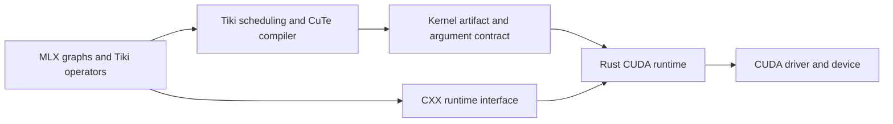

# Rust CUDA backend architecture

The Rust CUDA backend provides a resource-safe execution boundary for Tiki
graphs and compiled kernels. Its design separates tensor semantics, GPU
scheduling, and device execution so that improving one layer does not require
replacing the others. [ADR-0001](DECISION-2026-09-05.md) records the language and
interoperability choices; the [backend overview](README.md#implementation-status)
records implementation status.

The requirements in this document define the backend contract. They are
implementation obligations, not claims of completed verification.

## Responsibilities and boundaries

| Layer | Responsibility |
| --- | --- |
| MLX graph and Tiki operators | Tensor semantics, graph construction, and differentiation rules. |
| Tiki scheduling and CuTe compilation | Kernel specialization, data layout, thread assignment, and device code generation. |
| Rust CUDA runtime | Allocation ownership, access ordering, submission, completion, and resource retirement. |
| CXX bridge | Explicit interoperation between the existing C++ core and Rust-owned runtime objects. |
| CUDA driver and device | Module loading, command execution, and completion reporting. |

Tiki emits CuTe MLIR directly for supported graph regions. Compilation produces
a kernel artifact, including a CUDA device binary, its entry point, and the
information required to bind arguments and launch it. The runtime consumes
that artifact without requiring the compiler's Python execution environment on
the submission path. CuTile Rust's CUDA Tile IR is a separate compiler target;
using its host runtime components does not imply replacing CuTe compilation.

## Rationale for Rust

Asynchronous GPU work can continue after the host function that submits it
returns. Allocations, loaded modules, workspaces, and transfer destinations must
therefore outlive device use, not merely the submitting function. CUDA stream
ordering is also distinct from host-language object lifetime.

Rust provides ownership, borrowing, and explicit unsafe boundaries that can
encode these requirements in the runtime API. Resource owners can control
destruction, views can retain their backing storage, and completion objects can
represent outstanding device use. This reduces reliance on separate raw-pointer
conventions at individual call sites.

The choice preserves native host execution and the existing GPU compiler. It
does not depend on rewriting device kernels in Rust or on a particular GPU
extension to the Rust language. C++ can implement the same lifetime rules; Rust
is selected because its type system supports enforcing them across the safe
host interface.

## Rust implementation model

The backend uses ordinary Rust resource owners and explicit state transitions.
It does not expose CUDA pointers as general-purpose mutable host references.

- **Stable host toolchain.** Runtime and bridge code target stable Rust. GPU
  compiler internals and experimental Rust device-language extensions are not
  requirements of the host interface.
- **Concrete runtime types.** Allocation, kernel, submission, and executable
  graph objects each have a defined ownership responsibility. Driver and
  dependency types remain internal to the backend interface.
- **Ownership through completion.** Shared ownership represents resource
  liveness. Access descriptors and completion dependencies separately represent
  the permitted reads and writes.
- **Scoped borrowing.** A borrow used to prepare arguments cannot authorize
  device access beyond its lifetime unless submission establishes an independent
  resource owner and the required access ordering.
- **Explicit completion.** Submission and waiting are separate operations.
  Waiting can expose a synchronous or asynchronous host interface, but both
  enforce the same device-completion contract.
- **Typed errors.** Invalid arguments, unsupported capabilities, submission
  failures, and device failures remain distinguishable. An error does not release
  resources while previously submitted work can still access them.
- **A restricted unsafe layer.** CUDA calls, foreign handles, and binary argument
  construction are confined to reviewed adapters. Safe callers operate on
  validated runtime objects.

Thread-sharing guarantees must account for CUDA context affinity and resource
access ordering. Implementing `Send` or `Sync` for a foreign handle requires
that contract to be established in its adapter.

An asynchronous Rust future is an observation and ownership mechanism, not a
guarantee that device work can be cancelled. The backend must not depend on a
particular host executor to preserve allocation lifetime.

## Resource and access contracts

### Storage and views

Each allocation has one physical ownership authority and a stable identity.
Views retain that identity and describe a validated shape, offset, extent, and
stride mapping. Bounds validation must cover the addressable range, including
strided views, rather than only the logical element count.

Dependencies must account for views that alias the same allocation. Reference
counting alone does not establish exclusive access. Buffer donation or storage
reuse requires proof that no incompatible aliases or outstanding device uses
remain.

### Submission and retirement

A submission must retain every resource used by its commands: input and output
storage, temporary workspaces, loaded modules, and required execution handles.
Its access descriptors establish ordering against conflicting uses on other
streams. Independent work can execute concurrently.

Completion releases the submission's retention obligations. Dropping a caller
handle or a future must not release them early. After a partial submission
failure, resources remain retained until submitted work is known to have
completed or context teardown makes further device access impossible. Storage
with unproven completion is not eligible for reuse.

### CUDA graph replay

An executable graph retains its resource bindings for as long as replay is
permitted. A pending replay also retains the executable graph. Capturing a
temporary borrow and returning an independently replayable graph is invalid.

Graph updates and cache eviction must preserve resources used by outstanding
replays. Read/write ordering applies both within the graph and between replay
and other stream operations. Keeping a graph's allocations alive does not by
itself prevent concurrent conflicting access.

### Host transfers and exported buffers

Host access becomes available only after the required device work and transfer
complete. A transfer retains its source and destination through completion.
The return of a host CUDA API call is not sufficient evidence unless that API
guarantees completion for the specified transfer.

Any exported host view must remain attached to its storage owner and prevent
incompatible device access for the duration of the export. A writable NumPy or
C++ alias cannot bypass the runtime's access contract.

## Compiler and differentiation contracts

The artifact interface describes the entry point, target architecture, argument
representation, data types, shapes and strides where required, access modes,
alignment, launch dimensions, and shared-memory requirements. The runtime must
reject incompatible bindings before submission. Artifact and cache identities
must include the compiler and calling-convention information that affects
execution.

Artifact schemas and runtime calling conventions must have explicit compatibility
versions. Unsupported versions are rejected before a module or graph can execute.

The compiler must uphold the declared memory-access contract of emitted code.
The Rust runtime cannot infer that contract from an arbitrary device binary.
Externally supplied kernels enter through an explicitly trusted interface.

`forward` and `backward` are operator roles above the execution runtime. A
backward rule accepts the required primal values, saved forward values, and
output cotangents, and produces input cotangents. The runtime executes the
resulting commands under the same ownership rules as forward computation.
Forward-mode derivatives, batching, and differentiation of backward kernels
require their own declared support.

## C++ interoperability and dependency policy

The CXX bridge exposes opaque runtime owners and a limited set of backend
operations. Bridge definitions belong with the Rust types they expose. C++
does not depend on their field layout, allocator implementation, or upstream
crate types. The bridge checks representation compatibility; its adapters must
also uphold aliasing, error, and lifetime contracts across the language boundary.

This structure limits migration coupling. The MLX core can continue constructing
graphs while Rust assumes execution ownership. A supported operation has one
authority for its resources; ownership is not divided between independent C++
and Rust allocators. Other execution paths can remain under MLX ownership until
they are migrated.

CuTile runtime crates are candidates for implementation reuse. Their public
types do not define Tiki's backend interface, and adoption requires a pinned
revision with the verified contracts specified in ADR-0001. CXX is the selected
interop mechanism for the current boundary. Broader generated access through
Crubit remains an alternative if future integration requirements justify it.

## Qualification requirements

Backend qualification must cover forced allocation reuse, overlapping views,
cross-stream access, early future drop, partial submission failures, executable
graph updates, and cache eviction during device execution. The
[evaluation reproductions](repros/README.md) establish specific regression
cases; they are not a complete qualification suite.

Performance evaluation must separate compilation, cache lookup, host submission,
device execution, allocation, and transfers. Comparisons must identify the
kernel artifact, schedule, workload, and synchronization method. A language
choice or a correct kernel result does not establish equivalent performance.

The resulting safety guarantee depends on the validated safe API and its
reviewed unsafe implementation. It does not extend automatically to unrelated
C++ code, unchecked kernels, foreign aliases, or unqualified dependencies.
