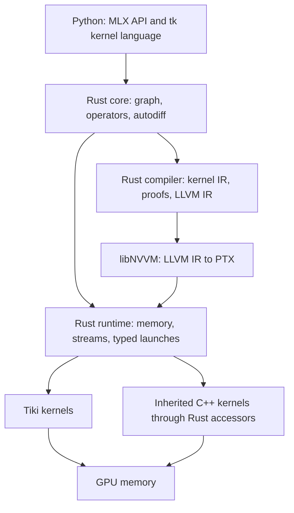

# ADR-0001: Memory-safe Rust execution

| Field | Value |
| --- | --- |
| Status | Accepted |
| Decided | September 5, 2026 |
| Revised | September 26, 2026 |
| Scope | Host code, GPU addresses, kernel placement |
| Specification | [Architecture](ARCHITECTURE.md) |
| Evidence | [Reproductions](repros/README.md) |

## Decision

Tiki is memory safe from its Python API to the GPU. Rust owns every line of
host code: the graph, operators, differentiation, compilation, allocation,
streams, launches, file loading, and distributed communication. Rust also
owns every GPU memory address. The Python API stays the same.

GPU kernels are written in Tiki's own kernel language, which follows CuTe's
semantics: layouts as algebra, tensors, thread-value partitions, and copy and
MMA atoms. Tiki's compiler proves each kernel's memory accesses from that
algebra and lowers it through LLVM IR and NVIDIA's `libNVVM` to PTX.

The revision changes four choices of the original decision:

- **Kernel language.** Tiki implements CuTe's semantics itself, in Rust with a
  Python frontend, from the BSD-3 CUTLASS sources. NVIDIA's CuTe DSL serves as
  a correctness and performance oracle only.
- **Compilation.** Tiki's compiler lowers kernels to LLVM IR and compiles them
  with `libNVVM`. The CuTe MLIR experiments become its reference design.
- **cuTile host runtime.** Tiki adopts the pinned cuTile Rust 0.4.0 host crates.
  F-04 records that the graph lifetime defect in F-01 no longer reproduces.
- **CXX.** The C++/Rust bridge carries the migration and is then removed. The
  finished system has no C++ on the host.

## Context

The C++ runtime inherited from MLX keeps producing one class of bug. In
[#1](https://github.com/dedalus-labs/tiki/pull/1), a NumPy export copied device
memory on one CUDA stream and freed the source on another. Nothing ordered the
free after the copy, and Compute Sanitizer reported a use-after-free on every
export.

The same class recurs across the codebase:

- [#47](https://github.com/dedalus-labs/tiki/pull/47): a strided view read four
  values of a freed array from a recycled allocation.
- [#62](https://github.com/dedalus-labs/tiki/pull/62): rejecting a view
  destroyed a buffer while an asynchronous copy still wrote to it.
- [#63](https://github.com/dedalus-labs/tiki/pull/63) and
  [#53](https://github.com/dedalus-labs/tiki/pull/53): misaligned storage
  reinterpretation and short file reads.

Each fix closes one instance. The class persists while C++ owns memory,
because every call site must remember the same rules. Rust ownership and a
checked tensor type make those rules part of the type system.

## Boundary

One rule places every piece of code:

1. **Runs on the CPU.** Rust.
2. **Computes a GPU address.** A layout in Tiki's kernel language, proven in
   bounds by the compiler.
3. **Runs on the GPU.** A kernel in Tiki's kernel language.
4. **Inherited CUDA C++ kernels.** Kept behind Rust accessors until each is
   ported, then deleted.
5. **Tensor-core GEMMs that Tiki kernels do not yet match.** CUTLASS, which
   computes its own addresses from checked inputs.

## Kernel language

Tiki needs thread-level control. Fast kernels choose how threads share work,
stage data through swizzled shared memory, and issue tensor-core and bulk-copy
instructions. CuTe expresses those choices as layouts, and its layout algebra
makes each choice composable and checkable.

The kernel language has two users. Researchers write kernels directly with
`@tk.kernel`, using layouts, tensors, thread-value partitions, and atoms. The
compiler writes kernels for fused MLX graph regions by choosing tiles and
partitions. Both paths produce the same kernel IR, pass the same proofs, and
lower the same way.

The compiler proves three properties of every kernel from its layouts:

- **Bounds.** The codomain of each thread's composed layout lies inside its
  tensor's bounds, whether the tensor lives in global memory, shared memory,
  or registers. Predicate masks cover partial tiles.
- **Disjoint writes.** Each thread writes shared memory through an injective
  partition, so no two threads write one element.
- **Barrier coverage.** A barrier or `mbarrier` wait separates every shared
  memory read from conflicting writes.

A kernel that fails a proof does not compile.

Kernels lower in stages. The kernel IR partitions tiles across threads and
selects atoms per architecture. A thread IR turns layout evaluation into
integer arithmetic and unrolls static loops. LLVM IR in the NVVM IR 2.0 form
carries NVVM intrinsics and inline PTX for instructions that lack intrinsics.
`libNVVM` produces PTX, and nvJitLink or the driver produces the GPU binary.

The layout algebra follows the CuTe whitepaper
([Cecka, arXiv:2603.02298](https://arxiv.org/abs/2603.02298)), which defines
every operation and post-condition. NVIDIA's Apache-2.0 reference
implementation, [PyCuTe](https://github.com/NVlabs/CuTe), supplies test vectors
that Tiki's Rust implementation must reproduce.

The atom table holds each architecture's copy and MMA instructions: vectorized
loads, `cp.async`, and `mma.sync` from Ampere, TMA and `wgmma` from Hopper, and
`tcgen05` from Blackwell. Its PTX comes from CuTe's BSD-3 architecture headers
with attribution. Partitioning, tiled copies and MMAs, and pipeline patterns
follow CuTe's and CUTLASS's BSD-3 C++ sources.

## Launch and access

Every kernel has a declared Rust signature, and a generated launcher is the
only way to run it. The launcher accepts only checked tensors, takes outputs
by `&mut` so no two launches write one array at once, and retains each
argument's storage until the device reports completion.

At module load, the runtime compares each declared signature with the
parameter offsets and sizes that `cuFuncGetParamInfo` reports for the compiled
kernel. A mismatch fails before any launch.

One function pushes a device pointer into a launch, inside `unsafe`. Its
safety argument rests on three facts established elsewhere:

- The tensor passed `Tensor::new`, so every address it describes lies in its
  storage.
- The storage stays retained until the submission completes.
- The declared signature matched the kernel at load.

Inherited C++ kernels receive opaque tensor handles. A handle's bytes contain the device
pointer, and C++ cannot read them without a cast that the lint rejects. Every
load and store calls a Rust device function, compiled to LTO-IR and inlined
into the C++ kernel by nvJitLink. cuda-oxide demonstrates this link in its
[`cpp_consumes_rust_device`](https://github.com/NVlabs/cuda-oxide/tree/ec4aa47/crates/rustc-codegen-cuda/examples/cpp_consumes_rust_device)
example on Blackwell. Architectures without that LTO-IR path use a C++
accessor header whose formula is property-tested against the Rust definition.

## Enforcement

Tiki kernels carry their proofs from compilation. Five further checks keep the
boundary in place:

- **Symbol check.** After each build, `nm` scans every C++ object for CUDA
  allocation, free, stream, event, graph, and module calls. Only the Rust
  runtime may reference them.
- **Source lint.** `clang-tidy` rejects pointer arithmetic in inherited kernel
  sources and any cast of an opaque tensor handle.
- **Sanitizers.** A merge-queue lane runs Compute Sanitizer's `memcheck` with
  leak checking and `racecheck` over the Python suite. PTX schedule
  perturbation from cuda-oxide's `ptx-schedule` widens the race search.
- **Trace diff.** Each Python test records its CUDA calls and kernel launches
  on the C++ and Rust builds, and the port accepts only matching traces.
- **Kernel certificates.** For inherited C++ kernels whose addresses are affine
  in thread indices and parameters, a build step proves every load and store
  in bounds from their PTX. This follows proof-carrying code
  ([Necula, POPL 1997](https://dl.acm.org/doi/10.1145/263699.263712)).

## Components

| Crate | Owns |
| --- | --- |
| `tiki-layout` | CuTe layout algebra, tensors, swizzles |
| `tiki-compile` | Kernel IR, proofs, LLVM IR |
| `tiki-cuda` | CUDA memory, streams, typed launches |
| `tiki-device` | Accessors for inherited C++ kernels |
| `tiki-core` | Graph, operators, differentiation |
| `tiki-metal` | Metal memory and command encoding |
| `tiki-cpu` | CPU kernels |
| `tiki-io` | File formats |

The Python kernel language traces into `tiki-compile`, and the Python bindings
move from nanobind to PyO3 as each component lands. `tiki-compile` loads
`libNVVM` through its C interface in a separate compiler process, so a compiler
failure ends one compilation with a typed error and never touches runtime
memory.

## Alternatives considered

**Fix each bug in C++.** Rejected. The same ownership mistake recurs at each
call site that handles memory, as #1, #47, and #62 show.

**Stop at NVIDIA's CuTe DSL.** Rejected. Its license is a revocable NVIDIA
EULA that forbids reverse engineering its compiler and restricts derivative
works, so Tiki could not fix, fork, or ship its kernel compiler. Its layout
algebra and atoms are available under BSD-3 in CUTLASS, and Tiki implements
them from there.

**Lower kernels to CUDA Tile IR.** Not selected as the kernel target. Tile IR
has no thread index, warp, or shared memory operations, so it cannot express
the thread-level control Tiki's kernels need. It also offers raw pointer
operations beside its bounded views.

**Rewrite kernels in cuda-oxide.** Not selected. cuda-oxide is an early alpha
on a pinned nightly toolchain, and its shared memory requires `unsafe`. Tiki
uses its PTX tooling and its Rust device interop for inherited C++ kernels.

**Crubit for the C++/Rust boundary.** Not selected. F-03 records its toolchain
and representation costs, and the boundary shrinks to device linking once the
host is Rust.

## Evaluated revisions

| Component | Revision | Environment |
| --- | --- | --- |
| cuTile Rust | 0.4.0 (crates.io) | GH200, CUDA 13.3 |
| cuTile Rust | `7f606336` | GH200, CUDA 13.3 |
| cuda-oxide | `ec4aa47` | Inspected, not executed |
| CuTe DSL | 4.8.0 (oracle only) | GH200, CUDA 13.3 |
| PyCuTe | `ab688bb5` (Apache-2.0) | Reference for the algebra |
| CUTLASS | BSD-3 sources | Reference for atoms and pipelines |
| CXX | 1.0.200 | macOS arm64 |
| Crubit | `6e856fe2` | macOS arm64 |

The cuTile Rust `7f606336` evaluation used Linux aarch64 and Rust 1.92.0. The
CXX and Crubit evaluations used Rust 1.97.1 and Apple Clang 21.0.0, with
Crubit on `nightly-2026-09-04` and `rustc-dev`.

## Evaluation findings

### F-01: cuTile scoped graph resource lifetime at `7f606336`

At this revision, `CudaGraph::scope` returns `CudaGraph<()>` without retaining
the borrowed input allocation. `Scope::record` consumes the operation and
releases its borrows, while later replay uses the recorded device addresses.

The reproduction captures a prefix sum over `0..127`, drops the input, and
allocates replacement buffers until the allocator reuses the captured address.
After that replacement is filled with `1000`, replay returns prefix values with
endpoints `1000` and `128000`, where `0` and `8128` are correct.

Every call site uses the safe Rust API, and the GPU consumes the replacement
data without an error. A test that does not force address reuse passes despite
the invalid lifetime. The
[reproduction procedure](repros/README.md#cutile-scoped-graph-lifetime) pins the
program and its expected results.

### F-02: CXX ownership and type placement

Construction, mutation, and ownership transfer pass between C++ and Rust, and
the generated C++ interface compiles with `-Wall -Wextra -Werror`.

Declaring an opaque Rust type owned by a sibling crate in the bridge produces
`E0117`, because the generated trait implementations violate Rust's orphan
rules. Defining the bridge beside its owning type avoids the adapter. The
[CXX procedures](repros/README.md#cxx-ownership-and-external-type-constraint)
include the working control and the intentional compile failure.

### F-03: Crubit generation and integration

The Cargo generator produces a C++ API directly from the Rust fixture, and a
C++ client constructs, mutates, and destroys the Rust buffer without
handwritten binding signatures.

The generated relocation code produces `-Wnontrivial-memcall` diagnostics with
Apple Clang 21.0.0, so a build with `-Werror` fails until
`-Wno-nontrivial-memcall` is added. Generator builds require nightly Rust and
`rustc-dev`. The generated fixture exposes the private `Vec<f32>`
representation to C++ and passes values through Crubit's `rs::Movable`
protocol. The
[pinned-header procedure](repros/README.md#crubit-generated-header-diagnostics)
reproduces the build constraint.

### F-04: cuTile 0.4.0 graph ownership

At 0.4.0, an instantiated graph takes ownership of its capture context and
recorded resources and keeps them until the graph is destroyed. The F-01
program, extended to replay after dropping its input, allocated 4,096
same-sized buffers without receiving the captured address, and replay read
the original input. Compute Sanitizer's `memcheck` reported zero errors.

`drop(input)` still compiles while the graph holds a capture of it. Safety
comes from the runtime retaining the buffer, and the borrow checker does not
reject the drop.
[#69](https://github.com/dedalus-labs/tiki/issues/69) records the run.

## Consequences

The port proceeds in order, tracked by
[#65](https://github.com/dedalus-labs/tiki/issues/65):

1. Strengthen the Python test contract, record CUDA traces, and write the
   porting guide and field-lifetime table.
2. Port three CUDA host files as a trial against those guides.
3. Port the remaining host code with one implementer and two adversarial
   reviewers per file.
4. Build the kernel language and port each inherited kernel to it.

Each step must pass `python/tests`, produce a clean trace diff, report zero
`memcheck` and `racecheck` errors, and keep device time within 5% of the C++
build.

Tiki pins every cuTile Rust, cuda-oxide, and CuTe DSL dependency to an exact
version or commit. An upgrade reruns the F-01 program and the qualification suite before
it lands.
