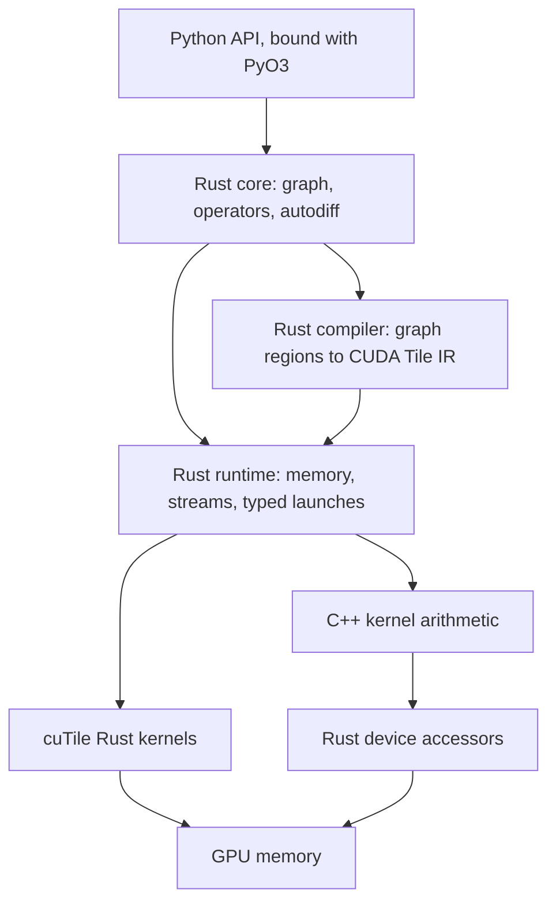

# ADR-0001: Memory-safe Rust execution

| Field | Value |
| --- | --- |
| Status | Accepted |
| Decided | September 5, 2026 |
| Revised | September 26, 2026 |
| Scope | Host code, GPU addresses, kernel placement |
| Specification | [Architecture](ARCHITECTURE.md) |
| Evidence | [Reproductions](repros/README.md) |

## Decision

Tiki is memory safe from its Python API to the GPU. Rust owns every line of
host code: the graph, operators, differentiation, compilation, allocation,
streams, launches, file loading, and distributed communication. Rust also
owns every GPU memory address. The Python API stays the same.

C++ remains only as arithmetic inside GPU kernels that a Rust kernel cannot
yet match. That arithmetic reads and writes memory only through Rust
accessors, so C++ code cannot allocate, free, launch, or form an address.

The revision changes three choices of the original decision:

- **Compilation.** A Rust compiler lowers graph regions to CUDA Tile IR. The
  CuTe MLIR compiler becomes its reference design.
- **cuTile host runtime.** Tiki adopts the pinned cuTile Rust 0.4.0 host crates.
  F-04 records that the graph lifetime defect in F-01 no longer reproduces.
- **CXX.** The C++/Rust bridge carries the migration and is then removed. The
  finished system has no C++ on the host.

## Context

The C++ runtime inherited from MLX keeps producing one class of bug. In
[#1](https://github.com/dedalus-labs/tiki/pull/1), a NumPy export copied device
memory on one CUDA stream and freed the source on another. Nothing ordered the
free after the copy, and Compute Sanitizer reported a use-after-free on every
export.

The same class recurs across the codebase:

- [#47](https://github.com/dedalus-labs/tiki/pull/47): a strided view read four
  values of a freed array from a recycled allocation.
- [#62](https://github.com/dedalus-labs/tiki/pull/62): rejecting a view
  destroyed a buffer while an asynchronous copy still wrote to it.
- [#63](https://github.com/dedalus-labs/tiki/pull/63) and
  [#53](https://github.com/dedalus-labs/tiki/pull/53): misaligned storage
  reinterpretation and short file reads.

Each fix closes one instance. The class persists while C++ owns memory,
because every call site must remember the same rules. Rust ownership and a
checked tensor type make those rules part of the type system.

## Boundary

One rule places every piece of code:

1. **Runs on the CPU.** Rust.
2. **Computes a GPU address.** Rust, as an inlined device accessor or a tile
   partition.
3. **Regular GPU arithmetic.** Rust kernels written with
   [cuTile Rust](https://github.com/NVlabs/cutile-rs).
4. **Irregular GPU arithmetic.** C++ calling Rust accessors, moving to
   [cuda-oxide](https://github.com/NVlabs/cuda-oxide) once its shared memory
   is safe and matches C++ speed.
5. **Tensor-core GEMMs that outperform cuTile.** CUTLASS, which computes its
   own addresses from checked inputs.

## Kernel placement

The deciding property is regularity. A regular kernel splits into tiles that
each read and write their own region. An irregular kernel needs threads that
cooperate through shared memory, shuffles, or atomics, or addresses that
depend on data.

| | Regular | Irregular |
| --- | --- | --- |
| Memory-bound | cuTile Rust | Accessor-fenced C++ |
| Compute-bound | cuTile Rust, benchmarked | Accessor-fenced C++ |

Regular memory-bound kernels include elementwise operations, copies,
reductions, normalization, and softmax. Regular compute-bound kernels include
matrix multiplication, attention, and convolution. NVIDIA's cuTile Rust
translation of TileGym's 24 operators, including attention and
mixture-of-experts, averaged 99.5% of cuTile Python's performance
([NVIDIA](https://developer.nvidia.com/blog/translating-cuda-tile-operations-from-python-to-rust-using-agentic-ai/)).

Irregular kernels include sort, scan, FFT, gather, and scatter. Each moves to
cuda-oxide when a port matches the C++ kernel's device time with its unsafe
code confined to shared-memory setup.

A GEMM stays on CUTLASS only while a cuTile version measures slower. The gate
is device time within 5% of the CUTLASS kernel, measured with CUPTI on the same
GPU.

## Launch and access

Every kernel has a declared Rust signature, and a generated launcher is the
only way to run it. The launcher accepts only checked tensors, takes outputs
by `&mut` so no two launches write one array at once, and retains each
argument's storage until the device reports completion.

At module load, the runtime compares each declared signature with the
parameter offsets and sizes that `cuFuncGetParamInfo` reports for the compiled
kernel. A mismatch fails before any launch.

One function pushes a device pointer into a launch, inside `unsafe`. Its
safety argument rests on three facts established elsewhere:

- The tensor passed `Tensor::new`, so every address it describes lies in its
  storage.
- The storage stays retained until the submission completes.
- The declared signature matched the kernel at load.

C++ kernels receive opaque tensor handles. A handle's bytes contain the device
pointer, and C++ cannot read them without a cast that the lint rejects. Every
load and store calls a Rust device function, compiled to LTO-IR and inlined
into the C++ kernel by nvJitLink. cuda-oxide demonstrates this link in its
[`cpp_consumes_rust_device`](https://github.com/NVlabs/cuda-oxide/tree/ec4aa47/crates/rustc-codegen-cuda/examples/cpp_consumes_rust_device)
example on Blackwell. Architectures without that LTO-IR path use a C++
accessor header whose formula is property-tested against the Rust definition.

## Enforcement

Five checks keep the boundary in place:

- **Symbol check.** After each build, `nm` scans every C++ object for CUDA
  allocation, free, stream, event, graph, and module calls. Only the Rust
  runtime may reference them.
- **Source lint.** `clang-tidy` rejects pointer arithmetic in kernel sources
  and any cast of an opaque tensor handle.
- **Sanitizers.** A merge-queue lane runs Compute Sanitizer's `memcheck` with
  leak checking and `racecheck` over the Python suite. PTX schedule
  perturbation from cuda-oxide's `ptx-schedule` widens the race search.
- **Trace diff.** Each Python test records its CUDA calls and kernel launches
  on the C++ and Rust builds, and the port accepts only matching traces.
- **Kernel certificates.** For kernels whose addresses are affine in thread
  indices and parameters, a build step proves every load and store lies in
  bounds under the launch contract. This follows proof-carrying code
  ([Necula, POPL 1997](https://dl.acm.org/doi/10.1145/263699.263712)). The
  loader refuses a kernel whose certificate does not match its binary.

## Components

| Crate | Owns |
| --- | --- |
| `tiki-layout` | Layouts, checked tensors, swizzles |
| `tiki-cuda` | CUDA memory, streams, typed launches |
| `tiki-device` | GPU accessors for C++ kernels |
| `tiki-compile` | Graph regions to CUDA Tile IR |
| `tiki-core` | Graph, operators, differentiation |
| `tiki-metal` | Metal memory and command encoding |
| `tiki-cpu` | CPU kernels |
| `tiki-io` | File formats |

`tiki-compile` builds Tile IR through `cutile-ir`, a pure Rust Tile IR builder
and bytecode writer with no LLVM or MLIR dependency. The Python bindings move
from nanobind to PyO3 as each component lands.

## Alternatives considered

**Fix each bug in C++.** Rejected. The same ownership mistake recurs at each
call site that handles memory, as #1, #47, and #62 show.

**Rewrite every kernel in Rust immediately.** Not selected. cuda-oxide is an
early alpha on a pinned nightly toolchain, its shared memory requires `unsafe`,
and no Rust equivalent of CUTLASS exists. Kernels move individually when a
Rust version matches their speed.

**Build Tiki on cuda-oxide.** Not selected as the foundation. Tiki uses its PTX
tooling and device interop, and the host runtime already shares cuda-oxide's
host crates through cuTile Rust.

**Crubit for the C++/Rust boundary.** Not selected. F-03 records its toolchain
and representation costs, and the boundary shrinks to device linking once the
host is Rust.

## Evaluated revisions

| Component | Revision | Environment |
| --- | --- | --- |
| cuTile Rust | 0.4.0 (crates.io) | GH200, CUDA 13.3 |
| cuTile Rust | `7f606336` | GH200, CUDA 13.3 |
| cuda-oxide | `ec4aa47` | Inspected, not executed |
| CXX | 1.0.200 | macOS arm64 |
| Crubit | `6e856fe2` | macOS arm64 |

The cuTile Rust `7f606336` evaluation used Linux aarch64 and Rust 1.92.0. The
CXX and Crubit evaluations used Rust 1.97.1 and Apple Clang 21.0.0, with
Crubit on `nightly-2026-09-04` and `rustc-dev`.

## Evaluation findings

### F-01: cuTile scoped graph resource lifetime at `7f606336`

At this revision, `CudaGraph::scope` returns `CudaGraph<()>` without retaining
the borrowed input allocation. `Scope::record` consumes the operation and
releases its borrows, while later replay uses the recorded device addresses.

The reproduction captures a prefix sum over `0..127`, drops the input, and
allocates replacement buffers until the allocator reuses the captured address.
After that replacement is filled with `1000`, replay returns prefix values with
endpoints `1000` and `128000`, where `0` and `8128` are correct.

Every call site uses the safe Rust API, and the GPU consumes the replacement
data without an error. A test that does not force address reuse passes despite
the invalid lifetime. The
[reproduction procedure](repros/README.md#cutile-scoped-graph-lifetime) pins the
program and its expected results.

### F-02: CXX ownership and type placement

Construction, mutation, and ownership transfer pass between C++ and Rust, and
the generated C++ interface compiles with `-Wall -Wextra -Werror`.

Declaring an opaque Rust type owned by a sibling crate in the bridge produces
`E0117`, because the generated trait implementations violate Rust's orphan
rules. Defining the bridge beside its owning type avoids the adapter. The
[CXX procedures](repros/README.md#cxx-ownership-and-external-type-constraint)
include the working control and the intentional compile failure.

### F-03: Crubit generation and integration

The Cargo generator produces a C++ API directly from the Rust fixture, and a
C++ client constructs, mutates, and destroys the Rust buffer without
handwritten binding signatures.

The generated relocation code produces `-Wnontrivial-memcall` diagnostics with
Apple Clang 21.0.0, so a build with `-Werror` fails until
`-Wno-nontrivial-memcall` is added. Generator builds require nightly Rust and
`rustc-dev`. The generated fixture exposes the private `Vec<f32>`
representation to C++ and passes values through Crubit's `rs::Movable`
protocol. The
[pinned-header procedure](repros/README.md#crubit-generated-header-diagnostics)
reproduces the build constraint.

### F-04: cuTile 0.4.0 graph ownership

At 0.4.0, an instantiated graph takes ownership of its capture context and
recorded resources and keeps them until the graph is destroyed. The F-01
program, extended to replay after dropping its input, allocated 4,096
same-sized buffers without receiving the captured address, and replay read
the original input. Compute Sanitizer's `memcheck` reported zero errors.

`drop(input)` still compiles while the graph holds a capture of it. Safety
comes from the runtime retaining the buffer, and the borrow checker does not
reject the drop.
[#69](https://github.com/dedalus-labs/tiki/issues/69) records the run.

## Consequences

The port proceeds in order, tracked by
[#65](https://github.com/dedalus-labs/tiki/issues/65):

1. Strengthen the Python test contract, record CUDA traces, and write the
   porting guide and field-lifetime table.
2. Port three CUDA host files as a trial against those guides.
3. Port the remaining host code with one implementer and two adversarial
   reviewers per file.
4. Move each kernel family to its placement.

Each step must pass `python/tests`, produce a clean trace diff, report zero
`memcheck` and `racecheck` errors, and keep device time within 5% of the C++
build.

Tiki pins every cuTile Rust and cuda-oxide dependency to an exact version or
commit. An upgrade reruns the F-01 program and the qualification suite before
it lands.
