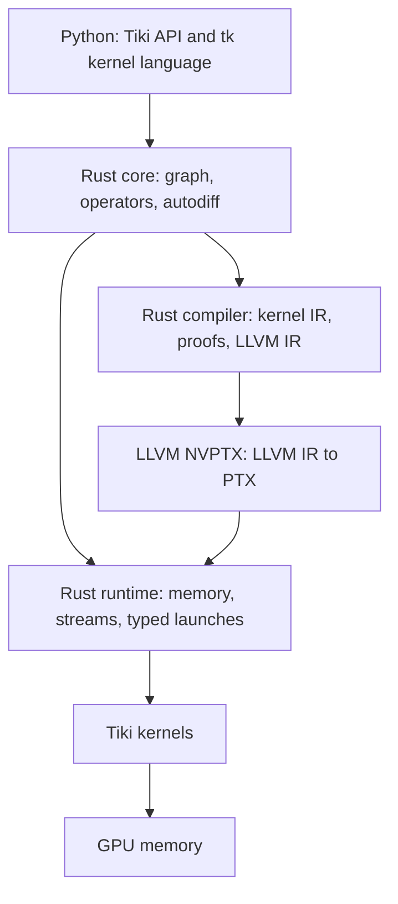

# ADR-0001: Memory-safe Rust execution

| Field | Value |
| --- | --- |
| Status | Accepted |
| Decided | September 5, 2026 |
| Revised | September 26, 2026 |
| Scope | Host code, kernel language, CUDA and Metal |
| Specification | [Architecture](ARCHITECTURE.md) |
| Evidence | [Reproductions](repros/README.md) |

## Decision

Tiki is memory safe from its Python API to the GPU. Rust owns every line of
host code: the graph, operators, differentiation, compilation, allocation,
streams, launches, file loading, and distributed communication. Rust also
owns every GPU memory address. The Python API stays the same.

GPU kernels are written in Tiki's own kernel language, which follows CuTe's
semantics: layouts as algebra, tensors, thread-value partitions, and copy and
MMA atoms. Tiki's compiler proves each kernel's memory accesses from that
algebra and lowers it through LLVM IR and LLVM's open NVPTX backend to PTX.

Everything on the execution path is Tiki's own code or open source, except a
vendor's user-space driver where no open one exists: `libcuda` on NVIDIA.
NVIDIA's closed libraries (the CUDA runtime, cuBLAS, NVRTC, `libNVVM`, CuTe DSL,
and cuTile) serve only as differential-testing oracles.

The revision changes four choices of the original decision:

- **Kernel language.** Tiki implements CuTe's semantics itself, in Rust with a
  Python frontend, from the BSD-3 CUTLASS sources. NVIDIA's CuTe DSL serves as
  a correctness and performance oracle only.
- **Compilation.** Tiki's compiler lowers kernels to LLVM IR and compiles them
  with upstream LLVM's NVPTX backend. The [CuTe MLIR experiments](https://github.com/dedalus-labs/tiki/tree/5555d20225b0befb21d7c56782384a20a1027b42/experiments/cute_backend)
  become its reference design.
- **Host runtime.** Tiki owns its host runtime. One `-sys` crate per target is
  the only call site into the vendor driver and the only Tiki code with
  `unsafe`: `tiki-cuda-sys` holds declarations generated from `cuda.h` and a
  checked adapter that hands out integers and results. Every other crate
  forbids `unsafe`.
- **Replacement.** The Rust stack is built beside the C++ backend, with its own
  entry points and no C++/Rust bridge. Differential tests run the Python suite
  on both until the Rust stack matches in results, features, and performance.
  One cutover then deletes the C++ backend.

## Context

The C++ runtime inherited from upstream MLX keeps producing one class of bug. In
[#1](https://github.com/dedalus-labs/tiki/pull/1), a NumPy export copied device
memory on one CUDA stream and freed the source on another. Nothing ordered the
free after the copy, and Compute Sanitizer reported a use-after-free on every
export.

The same class recurs across the codebase:

- [#47](https://github.com/dedalus-labs/tiki/pull/47): a strided view read four
  values of a freed array from a recycled allocation.
- [#62](https://github.com/dedalus-labs/tiki/pull/62): rejecting a view
  destroyed a buffer while an asynchronous copy still wrote to it.
- [#63](https://github.com/dedalus-labs/tiki/pull/63) and
  [#53](https://github.com/dedalus-labs/tiki/pull/53): misaligned storage
  reinterpretation and short file reads.

Each fix closes one instance. The class persists while C++ owns memory,
because every call site must remember the same rules. Rust ownership and a
checked tensor type make those rules part of the type system.

## Boundary

One rule places every piece of code:

1. **Runs on the CPU.** Rust.
2. **Computes a GPU address.** A layout in Tiki's kernel language, proven in
   bounds by the compiler.
3. **Runs on the GPU.** A kernel in Tiki's kernel language.
4. **Inherited CUDA C++ kernels.** Stay in the C++ backend, which the cutover
   deletes.
5. **Tensor-core GEMMs that Tiki kernels do not yet match.** CUTLASS, which
   computes its own addresses from checked inputs.

```mermaid
flowchart TB
    python[Python: Tiki API and tk kernel language] --> core[Rust core: graph, operators, autodiff]
    core --> compiler[Rust compiler: kernel IR, proofs, LLVM IR]
    compiler --> nvvm[LLVM NVPTX: LLVM IR to PTX]
    core --> runtime[Rust runtime: memory, streams, typed launches]
    nvvm --> runtime
    runtime --> kernels[Tiki kernels]
    kernels --> gpu[GPU memory]
```

## Kernel language

Tiki needs thread-level control. Fast kernels choose how threads share work,
stage data through swizzled shared memory, and issue tensor-core and bulk-copy
instructions. CuTe expresses those choices as layouts, and its layout algebra
makes each choice composable and checkable.

The kernel language has two users. Researchers write kernels directly with
`@tk.kernel`, using layouts, tensors, thread-value partitions, and atoms. The
compiler writes kernels for fused Tiki graph regions by choosing tiles and
partitions. Both paths produce the same kernel IR, pass the same proofs, and
lower the same way.

The compiler proves three properties of every kernel from its layouts:

- **Bounds.** The codomain of each thread's composed layout lies inside its
  tensor's allocation, whether the tensor lives in global memory, shared
  memory, or registers.
- **Disjoint writes.** Each thread writes shared memory through an injective
  partition, so no two threads write one element.
- **Barrier coverage.** A barrier or `mbarrier` wait separates every shared
  memory read from conflicting writes.

A kernel that fails a proof does not compile.

Kernels lower in stages. The kernel IR partitions tiles across threads and
selects atoms per architecture. A thread IR turns layout evaluation into
integer arithmetic and unrolls static loops. LLVM IR in the NVVM IR 2.0 form
carries NVVM intrinsics and inline PTX for instructions that lack intrinsics.
LLVM's NVPTX backend produces PTX, and nvJitLink or the driver produces the GPU
binary.

Extents are traced as static or dynamic. A static extent, such as a tile size,
becomes a constant the compiler folds, so bounds within a tile follow from
arithmetic. A dynamic extent, such as a sequence length, becomes a kernel
parameter, a polynomial variable whose facts, positivity and a divisor, the
kernel declares. The algebra decides each precondition from those facts and
refuses a kernel whose layout depends on a condition they leave open. At
launch, the runtime checks the grid size and each tensor's shape against the
kernel's contract, which are the facts the proof assumed.

A partial tile at the end of a dynamic mode is safe to read whole when the
tile stays inside the tensor's allocation, and reading it unmasked is often
faster than masking every load. The bounds proof covers the allocation. The
compiler generates the boundary mask for each dynamic mode, and a value proof
keeps every lane past the logical extent out of the kernel's results.

Layouts are data inside the compiler, with each extent tagged static or
dynamic. The algebra runs as ordinary code during compilation and never
through the host language's type system, so compiling a kernel costs
milliseconds before LLVM runs.

The layout algebra follows the CuTe whitepaper
([Cecka, arXiv:2603.02298](https://arxiv.org/abs/2603.02298)), which defines
every operation and post-condition. `tiki-cute` reproduces every integer call
in the test suite of NVIDIA's Apache-2.0 reference implementation,
[PyCuTe](https://github.com/NVlabs/CuTe/tree/111253d17e2f0f8631f43999b43ac4afa5954b04).
It also checks the whitepaper's condition for composing a hierarchical layout
mode by mode (Equation 23), which PyCuTe skips, so it refuses compositions
whose summed modes carry across a mode of the left layout.

The atom table holds each architecture's copy and MMA instructions: vectorized
loads, `cp.async`, and `mma.sync` from Ampere, TMA and `wgmma` from Hopper, and
`tcgen05` from Blackwell. Its PTX comes from CuTe's BSD-3 architecture headers
with attribution. Partitioning, tiled copies and MMAs, and pipeline patterns
follow CuTe's and CUTLASS's BSD-3 C++ sources.

## Apple GPUs

Tiki also targets Apple GPUs through Metal. The kernel IR and thread IR are
target-neutral: layouts, partitions, proofs, and per-thread arithmetic are the
same for both targets. Only atom selection and the final emitter depend on the
target.

| CUDA | Metal |
| --- | --- |
| Thread block | Threadgroup |
| Warp | SIMD-group |
| Shared memory | Threadgroup memory |
| `mma.sync`, `wgmma`, `tcgen05` | `simdgroup_matrix` |
| LLVM IR, NVPTX, `ptxas` | Metal Shading Language, Apple compiler |

The Metal emitter writes Metal Shading Language source, compiled by Apple's
compiler ahead of time into a `.metallib` or at load time from source, as Tiki
does. Metal has no bulk-copy or `mbarrier` hardware, so its pipelines use
threadgroup barriers. Tiki's MIT-licensed Metal kernels are the reference for
Apple tile shapes and `simdgroup_matrix` use.

## Launch and access

Every kernel has a declared Rust signature, and a generated launcher is the
only way to run it. The launcher accepts only checked tensors, takes outputs
by `&mut` so no two launches write one array at once, and retains each
argument's storage until the device reports completion.

At module load, the runtime compares each declared signature with the
parameter offsets and sizes that `cuFuncGetParamInfo` reports for the compiled
kernel. A mismatch fails before any launch.

One function pushes a device pointer into a launch, inside `unsafe`. Its
safety argument rests on three facts established elsewhere:

- The tensor passed `Tensor::new`, so every address it describes lies in its
  storage.
- The storage stays retained until the submission completes.
- The declared signature matched the kernel at load.

Inherited C++ kernels receive opaque tensor handles. A handle's bytes contain the device
pointer, and C++ cannot read them without a cast that the lint rejects. Every
load and store calls a Rust device function, compiled to LTO-IR and inlined
into the C++ kernel by nvJitLink. cuda-oxide demonstrates this link in its
[`cpp_consumes_rust_device`](https://github.com/NVlabs/cuda-oxide/tree/ec4aa47/crates/rustc-codegen-cuda/examples/cpp_consumes_rust_device)
example on Blackwell. Architectures without that LTO-IR path use a C++
accessor header whose formula is property-tested against the Rust definition.

## Enforcement

Tiki kernels carry their proofs from compilation. Three further checks keep the
boundary in place:

- **Unsafe check.** Every Tiki crate except the per-target `-sys` crates
  declares `#![forbid(unsafe_code)]`, and CI rejects any other `unsafe`.
- **Source lint.** `clang-tidy` rejects pointer arithmetic in inherited kernel
  sources and any cast of an opaque tensor handle.
- **Sanitizers.** A merge-queue lane runs Compute Sanitizer's `memcheck` with
  leak checking and `racecheck` over the Python suite. PTX schedule
  perturbation from cuda-oxide's `ptx-schedule` widens the race search.
- **Differential tests.** Each Python test runs on the C++ backend and on the
  Rust stack, and their results must match. Closed NVIDIA libraries serve as
  further oracles for individual kernels.

## Components

| Crate | Owns |
| --- | --- |
| `tiki-cute` | CuTe layout algebra, tensors, swizzles |
| `tiki-compile` | Kernel IR, proofs, LLVM IR |
| `tiki-cuda-sys` | The only call site into `libcuda`: generated declarations, checked adapter |
| `tiki-cuda-runtime` | CUDA memory, streams, completion, typed launches |
| `tiki-core` | Graph, operators, differentiation |
| `tiki-metal` | Metal memory and command encoding |
| `tiki-cpu` | CPU kernels |
| `tiki-io` | File formats |

The Python kernel language traces into `tiki-compile`. The Rust stack has its
own PyO3 bindings behind the same Python API, which is what the differential
tests run. `tiki-compile` loads
a pinned LLVM in a separate compiler process, so a compiler
failure ends one compilation with a typed error and never touches runtime
memory.

## Alternatives considered

**Fix each bug in C++.** Rejected. The same ownership mistake recurs at each
call site that handles memory, as #1, #47, and #62 show.

**Stop at NVIDIA's CuTe DSL.** Rejected. Its license is a revocable NVIDIA
EULA that forbids reverse engineering its compiler and restricts derivative
works, so Tiki could not fix, fork, or ship its kernel compiler. Its layout
algebra and atoms are available under BSD-3 in CUTLASS, and Tiki implements
them from there.

**Lower kernels to CUDA Tile IR.** Not selected as the kernel target. Tile IR
has no thread index, warp, or shared memory operations, so it cannot express
the thread-level control Tiki's kernels need. It also offers raw pointer
operations beside its bounded views.

**Rewrite kernels in cuda-oxide.** Not selected. cuda-oxide is an early alpha
on a pinned nightly toolchain, and its shared memory requires `unsafe`. Tiki
uses its PTX tooling and its Rust device interop for inherited C++ kernels.

**Compile with NVIDIA's `libNVVM`.** Not selected as the code generator.
`libNVVM` runs the same device optimizer as `nvcc`, but it is closed, so Tiki
could not read, fix, or upstream changes to it. LLVM's NVPTX backend accepts the
same LLVM IR, and Tiki pins and vendors LLVM when a fix must ship before it
lands upstream. Tiki's atoms are inline PTX, so new hardware instructions do not
wait for NVPTX intrinsics. `libNVVM` compiles the same IR in CI as a
differential check.

**Crubit for the C++/Rust boundary.** Not selected. F-03 records its toolchain
and representation costs.

**Port the C++ backend in place through a CXX bridge.** Tried and reverted. A
Rust allocator under the C++ backend (#8, #96) ran one backend in two
languages, with a seam between them that neither side's tests owned. The
parallel build has no bridge.

**cuTile Rust host crates.** Not selected. Their allocation, copy, advice, and
launch functions are `pub unsafe fn`, so every caller writes `unsafe`, and the
project is NVIDIA-owned and pre-1.0. Tiki's host layer wraps the driver itself
and exports only safe functions.

## Evaluated revisions

| Component | Revision | Environment |
| --- | --- | --- |
| cuTile Rust | 0.4.0 (crates.io) | GH200, CUDA 13.3 |
| cuTile Rust | `7f606336` | GH200, CUDA 13.3 |
| cuda-oxide | `ec4aa47` | Inspected, not executed |
| CuTe DSL | 4.8.0 (oracle only) | GH200, CUDA 13.3 |
| PyCuTe | `111253d1` (Apache-2.0) | Reference for the algebra |
| LLVM | NVPTX backend, pinned | Code generator |
| CUTLASS | BSD-3 sources | Reference for atoms and pipelines |
| CXX | 1.0.200 | macOS arm64 |
| Crubit | `6e856fe2` | macOS arm64 |

The cuTile Rust `7f606336` evaluation used Linux aarch64 and Rust 1.92.0. The
CXX and Crubit evaluations used Rust 1.97.1 and Apple Clang 21.0.0, with
Crubit on `nightly-2026-09-04` and `rustc-dev`.

## Evaluation findings

### F-01: cuTile scoped graph resource lifetime at `7f606336`

At this revision, `CudaGraph::scope` returns `CudaGraph<()>` without retaining
the borrowed input allocation. `Scope::record` consumes the operation and
releases its borrows, while later replay uses the recorded device addresses.

The reproduction captures a prefix sum over `0..127`, drops the input, and
allocates replacement buffers until the allocator reuses the captured address.
After that replacement is filled with `1000`, replay returns prefix values with
endpoints `1000` and `128000`, where `0` and `8128` are correct.

Every call site uses the safe Rust API, and the GPU consumes the replacement
data without an error. A test that does not force address reuse passes despite
the invalid lifetime. The
[reproduction procedure](repros/README.md#cutile-scoped-graph-lifetime) pins the
program and its expected results.

### F-02: CXX ownership and type placement

Construction, mutation, and ownership transfer pass between C++ and Rust, and
the generated C++ interface compiles with `-Wall -Wextra -Werror`.

Declaring an opaque Rust type owned by a sibling crate in the bridge produces
`E0117`, because the generated trait implementations violate Rust's orphan
rules. Defining the bridge beside its owning type avoids the adapter. The
[CXX procedures](repros/README.md#cxx-ownership-and-external-type-constraint)
include the working control and the intentional compile failure.

### F-03: Crubit generation and integration

The Cargo generator produces a C++ API directly from the Rust fixture, and a
C++ client constructs, mutates, and destroys the Rust buffer without
handwritten binding signatures.

The generated relocation code produces `-Wnontrivial-memcall` diagnostics with
Apple Clang 21.0.0, so a build with `-Werror` fails until
`-Wno-nontrivial-memcall` is added. Generator builds require nightly Rust and
`rustc-dev`. The generated fixture exposes the private `Vec<f32>`
representation to C++ and passes values through Crubit's `rs::Movable`
protocol. The
[pinned-header procedure](repros/README.md#crubit-generated-header-diagnostics)
reproduces the build constraint.

### F-04: cuTile 0.4.0 graph ownership

At 0.4.0, an instantiated graph takes ownership of its capture context and
recorded resources and keeps them until the graph is destroyed. The F-01
program, extended to replay after dropping its input, allocated 4,096
same-sized buffers without receiving the captured address, and replay read
the original input. Compute Sanitizer's `memcheck` reported zero errors.

`drop(input)` still compiles while the graph holds a capture of it. Safety
comes from the runtime retaining the buffer, and the borrow checker does not
reject the drop.
[#69](https://github.com/dedalus-labs/tiki/issues/69) records the run.

## Consequences

The replacement proceeds in order, tracked by
[#65](https://github.com/dedalus-labs/tiki/issues/65):

1. Strengthen the Python test contract and run it on both backends.
2. Build the Rust stack beside the C++ backend: runtime, compiler, kernels,
   and PyO3 bindings.
3. Run the differential suite until the Rust stack matches the C++ backend.
4. Cut over in one change that deletes the C++ backend.

The cutover requires the Python suite to pass on the Rust stack with results
matching the C++ backend, zero `memcheck` and `racecheck` errors, and device
time within 5% of the C++ backend.

Tiki pins every oracle (CuTe DSL, cuTile, `libNVVM`) and tool (cuda-oxide's
PTX tooling) to an exact version or commit. An upgrade reruns the
qualification suite before it lands.
